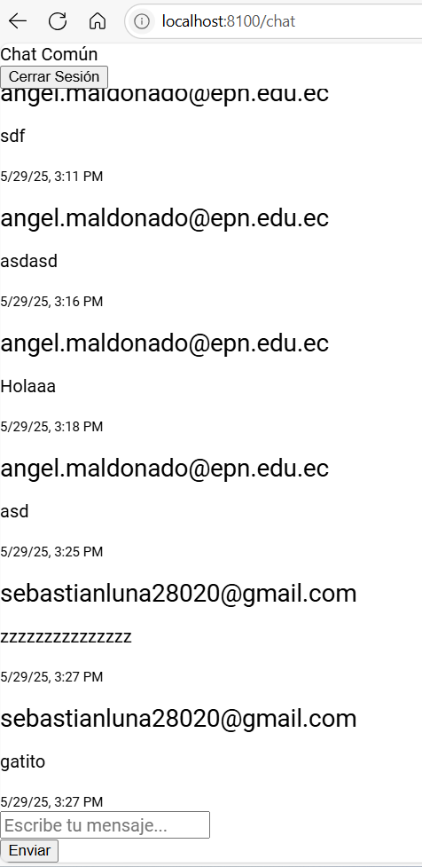
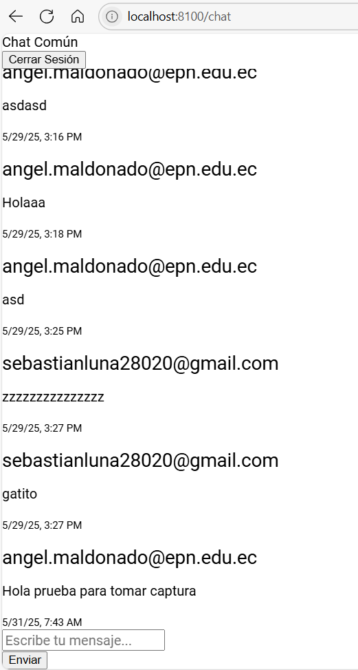
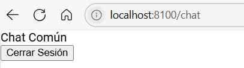
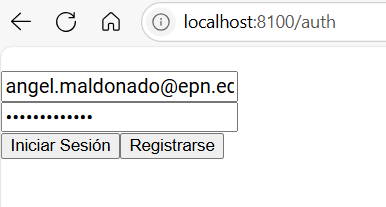
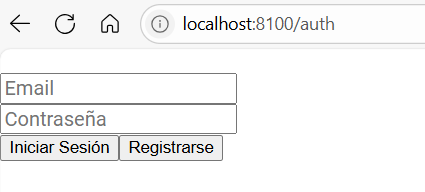

# Estudiantes: Nicolás Luna, Angel Maldonado

# Auth y Chat con Supabase - App

Aplicación móvil desarrollada con **Angular** e **Ionic**, que permite autenticarse y utilizar un chat compartido en **Supabase**.

## 📱 Descripción

Esta app utiliza Supabase, permitiendo que los usuarios se autentiquen por medio del servicio de autenticación de Supabase, como también utilizar un chat compartido, cuya base de datos se encuentra alojada en Supabase.

## 📷Capturas de pantalla
 - **Página de autenticación**

 - **Chat cuando el usuario ha iniciado sesión**

 - **Prueba de uso del chat**

 - **Cierre de sesión**

 - **Intento de acceso al Chat sin iniciar sesión**

